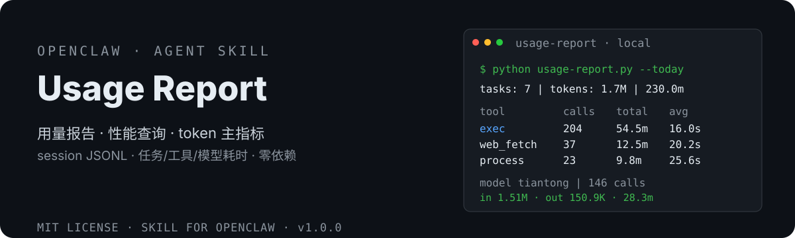

# OpenClaw Usage Report 📊

<div align="center">
  <strong>🇨🇳 中文</strong> | <a href="README.en.md">🌐 English</a>
</div>

<p align="center">
  
</p>

> 回答「每次 agent 任务花了多久、用了哪些工具/技能/模型、消耗了多少 token」。
> OpenClaw usage & performance reporting — how long each task took, which tools/skills/models were used, how many tokens were consumed.


[](https://clawhub.ai/dtsola/skills/xiaoyaoclaw-usage-report)

## 为什么需要它

OpenClaw 没有内置 per-task 性能面板。想优化你的 agent，你却：
- ❌ **不知道每次任务花了多久**：没有耗时统计，只能靠感觉
- ❌ **找不到最慢的工具**：exec / web_fetch / process 谁是瓶颈，没有数据
- ❌ **token 消耗对不上账**：每个 agent/模型吃了多少 token，一片模糊
- ❌ **技能使用无迹可查**：哪些 skill 被用过、用了几次，无人知晓

但数据其实一直在——本地 session JSONL（`state/agents/*/sessions/*.jsonl`）完整记录了每次任务/工具/模型调用的时间戳与 token 消耗。本工具直接消费这份数据：**零依赖 · 纯本地 · 数据不出机器**。

## 特性

- ⏱️ **任务耗时**：每次任务的窗口耗时 + 活跃耗时（排除用户思考间隔）
- 🔢 **模型 token**：按 agent/模型聚合——调用次数、输入/输出 token（真实消耗 = input+output）
- 🧮 **模型耗时**：近似估算（事件 ts 间隔，cap 10min），按 agent/模型聚合总耗时与平均
- 🔧 **工具耗时**：按工具聚合次数/失败/总耗时/平均/最慢——直接定位瓶颈
- 🧩 **Skills 使用**：从 read 调用推断——技能名、读取次数、使用 agent
- 📈 **每日趋势**：每日输入/输出 token、调用数
- 🤖 **MCP 工具**：与普通工具同构（toolCall/toolResult），天然覆盖
- 🔒 **零依赖纯本地**：仅 Python 标准库，无外部依赖、无数据上传
- ⏰ **Cron 日报可选项**：`--today --json` 挂定时任务，是否启用由你决定

## 安装

```bash
# ClawHub（推荐）
clawhub install xiaoyaoclaw-usage-report

# 或从 GitHub 手动安装
git clone https://github.com/dtsola/xiaoyaoclaw-usage-report
# 把 scripts/usage-report.py 放到你的脚本目录
```

## 使用

1. 安装技能（ClawHub 或手动放入 skills 目录）
2. 直接对 agent 说「**跑今日用量报告**」，agent 会自动：
   - 定位 usage-report 技能 → 检测 OpenClaw state 目录
   - 解析全部 agent 的 session JSONL → 输出任务耗时 / 模型 token / 工具耗时 / 技能使用 / 每日趋势
3. 继续对话追问：最慢工具、按 agent 对账、近 7 天趋势、技能盘点
4. 可选：说「配置每天 22:00 自动推送用量报告」开启定时日报

### 命令行参考（可选）

不想通过对话、想直接跑脚本时：

```bash
python scripts/usage-report.py --today    # 今日（默认全维度）
python scripts/usage-report.py --week     # 近 7 天
python scripts/usage-report.py --all      # 全部
python scripts/usage-report.py --agent xiaoxia   # 按 agent 过滤
python scripts/usage-report.py --by-tool  # 仅工具耗时
python scripts/usage-report.py --skills   # 仅技能使用
python scripts/usage-report.py --today --json > usage-report.json   # JSON 输出
```

数据目录默认自动检测（Windows 小遥Claw：`C:\Users\<user>\AppData\Roaming\xiaoyaoclaw-desktop\runtime\openclaw\state`）；覆盖用 `--state <路径>` 或环境变量 `OPENCLAW_STATE`。

## 🚀 快速上手（三步，5 分钟）

### Step 1：安装技能

```bash
clawhub install xiaoyaoclaw-usage-report
```

### Step 2：一句话触发第一份报告

对你的 agent 说：

> 跑今日用量报告

agent 自动完成：定位 usage-report 技能 → 检测 state 目录 → 解析全部 session JSONL → 输出任务耗时 / 模型 token / 工具耗时 / 技能使用 / 每日趋势总览。

### Step 3：验收 + 对话式进阶查询

打开报告看这几个关键块：

```
📊 总览: 7 个任务 | 总 token(input+output): 1,747,066 | 总耗时: 230.0m

📦 按 agent / 模型（token=input+output 真实消耗；模型耗时≈事件ts间隔，cap 10min）
  Agent     模型                      调用    输入tok    输出tok   模型总耗时  平均
  tiantong  deepseek/deepseek-v4-flash  146  1,513,943  150,870      28.3m  11.6s

🔧 按工具（耗时 = toolResult - toolCall）
  工具        次数  失败   总耗时   平均   最慢
  exec        204    1    54.5m  16.0s  6.2m
```

不用记任何命令，直接对话追问：

> 哪个工具最慢？哪个 agent 用 token 最多？近 7 天每天消耗多少？

想每天自动收到日报，对 agent 说：

> 配置每天 22:00 自动推送用量报告

### 日常使用习惯

| 场景 | 对 agent 说 |
|---|---|
| 每日对账 | 「跑今日用量报告」，或挂 cron 每日 22:00 自动推送 |
| 定位瓶颈 | 「哪个工具最慢」→ 优先优化它 |
| 技能盘点 | 「哪些技能用得多、哪些闲置」 |
| 按 agent 对账 | 「xiaoxia 今天花了多少 token」 |
| 发布前评估 | 「跑近 7 天用量报告」看消耗趋势 |
| 自动化 | 「配置每天 22:00 自动推送用量报告」 |

## 统计口径（重要）

1. **token 真实消耗 = input + output**。`totalTokens` 含 cacheRead（每轮重复计数），缓存命中率越高虚高越严重（实测 1.3x~14x+，单条最高 568x）——脚本已规避。
2. **工具耗时 = toolResult.ts − assistant(toolCall).ts**，含模型生成 toolCall 的决策时间（非纯执行时间）。
3. **模型耗时为近似估算**（assistant 事件 ts − 前一条事件 ts，cap 10min）。⚠️ 不能用 message.timestamp（批量写入时间戳）；精确 duration 仅在 OpenClaw diagnostics-otel 事件层。
4. **成本维度不提供**：各模型供应商定价不同，token 是通用主指标；如需成本，自行在 OpenClaw 配置 `models.providers.*.cost` 后扩展。
5. **skills 统计**：仅覆盖「被 read 加载过」的技能（metadata 注入未加载的不计）。

## Cron 每日日报（可选项，用户自行设置）

工具支持 `--today --json` 输出，可挂定时任务生成每日 token 日报。是否启用、何时推送，完全由使用者决定。

OpenClaw 内可用 cron：

```json
{
  "name": "openclaw-usage-daily",
  "schedule": { "kind": "cron", "expr": "0 22 * * *", "tz": "Asia/Shanghai" },
  "payload": {
    "kind": "agentTurn",
    "message": "运行 `python <脚本路径>/usage-report.py --today` 并把报告发送给我"
  },
  "sessionTarget": "isolated",
  "delivery": { "mode": "announce" }
}
```

或用 Windows 计划任务 / Linux crontab 直接跑脚本并输出到文件。

## 与其他方案的区别

| | claw-lens（本地看板） | **xiaoyaoclaw-usage-report** |
|---|---|---|
| 形态 | Node Web 看板，需启动服务 | ✅ 零依赖 Python CLI，单文件 |
| 安装成本 | npm 安装 + 服务常驻 | ✅ 即拷即用 |
| 数据源 | 同一份 session JSONL | ✅ 同一份 session JSONL |
| 模型耗时 | 不提供 | ✅ 近似估算（事件 ts 间隔） |
| token 口径 | 不区分 | ✅ input+output 真实消耗，规避 cacheRead 虚高 |
| 输出 | Web 可视化图表 | ✅ 终端表格 + JSON 管道（cron/CI 友好） |
| 数据安全 | 本地 | ✅ 本地，零上传 |

## 目录结构

```
xiaoyaoclaw-usage-report/
├── SKILL.md                    # 技能主体（用法 + 触发方式）
├── scripts/
│   └── usage-report.py         # 主脚本（零依赖纯标准库）
├── docs/
│   └── DESIGN.md               # 设计方案
├── assets/readme/
│   ├── hero.svg                # README 头图
│   └── community-qr.png        # 交流群二维码
├── README.md
└── LICENSE
```

## License

MIT — 随便用，署名可选。

---

## 🛠️ 需要定制？

**Agent & Skills 定制，价格 ¥800 起。**

- 微信：`dtsola`（添加好友时备注：**openclaw定制**）
- 服务范围：OpenClaw 多 agent 部署 / 工作区规范化 / 自定义 Skill 开发 / 用量监控与优化

## 💬 加入交流群

小遥全系产品用户交流群——产品反馈 · 使用交流 · 功能建议：

<p align="center">
  
</p>

<p align="center">扫码加群，或添加微信 <code>dtsola</code>（备注：<b>加群</b>）</p>

## 姊妹项目

- 🏠 **xiaoyaoclaw-workspace-initializer**（工作区初始化器）：给每个 agent 一个「家」——标准目录结构 + WORKSPACE.md 规范 + 多 agent 配置安全。<https://github.com/dtsola/xiaoyaoclaw-workspace-initializer>
- 🧠 **xiaoyaoclaw-memory-distill**（记忆蒸馏）：把对话蒸馏成结构化记忆——语义分级 + 首次建忆 + 增量去重 + 敏感跳过。<https://github.com/dtsola/xiaoyaoclaw-memory-distill>
- 🗂️ **xiaoyaoclaw-task-progress-tracker**（任务进度跟踪器）：目录即容器，PROGRESS.md 即进度——tasks/ 与 projects/ 生命周期管理。<https://github.com/dtsola/xiaoyaoclaw-task-progress-tracker>
- 📚 **xiaoyaoclaw-kb-retriever**（知识库检索器）：本地知识库检索——分层 data_structure.md 索引 + 渐进式检索（md/pdf/xlsx），零依赖双平台。<https://github.com/dtsola/xiaoyaoclaw-kb-retriever>
- 🩹 **xiaoyaoclaw-workspace-auditor**（工作区体检）：只读审计 5 类健康度 + 分级报告 + 修复建议，零依赖脚本永不改文件。<https://github.com/dtsola/xiaoyaoclaw-workspace-auditor>
- 📎 **xiaoyaoclaw-web-clipper**（网页剪藏）：任意网页 → 带 frontmatter 的本地 Markdown——双引擎提取降级链 + 批量剪藏 + 去重，直通知识库。<https://github.com/dtsola/xiaoyaoclaw-web-clipper>
- 🤝 **xiaoyaoclaw-agent-orchestrator**（Agent 协作编排）：拆任务、分 agent、管进度、聚结果、失败重试——多 agent 日常协作调度。<https://github.com/dtsola/xiaoyaoclaw-agent-orchestrator>
- 🎛️ **xiaoyaoclaw-commander**（跨工具指挥官，**指挥层**）：让任意支持 Agent Skills 的工具（Claude Code / Codex / OpenCode / Trae / DSH）指挥小遥Claw / OpenClaw 多 agent 系统。<https://github.com/dtsola/xiaoyaoclaw-commander>
